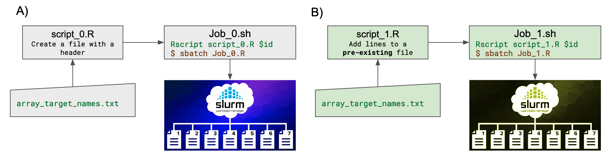
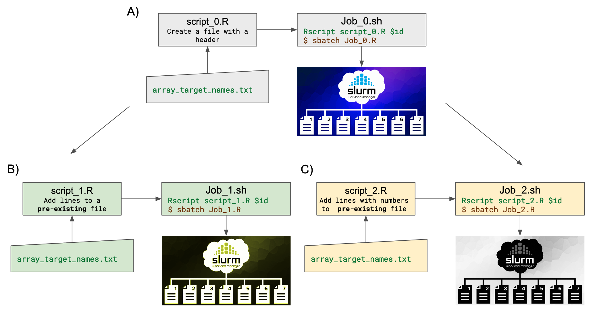
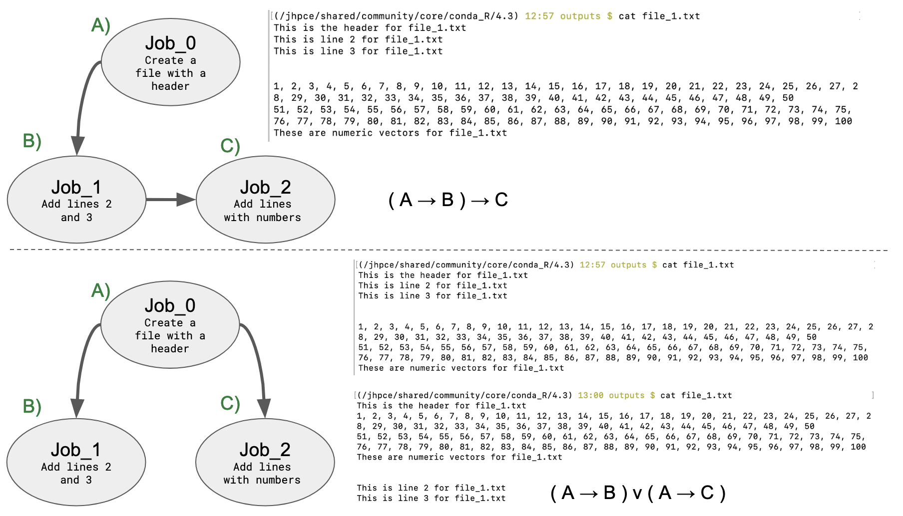
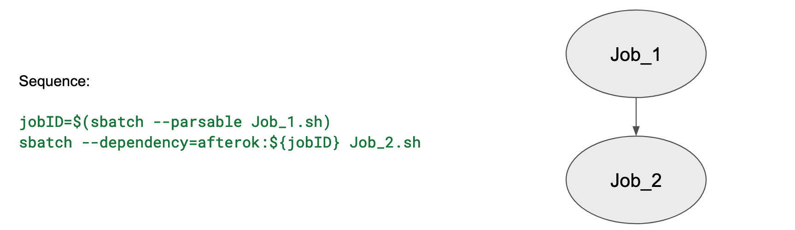
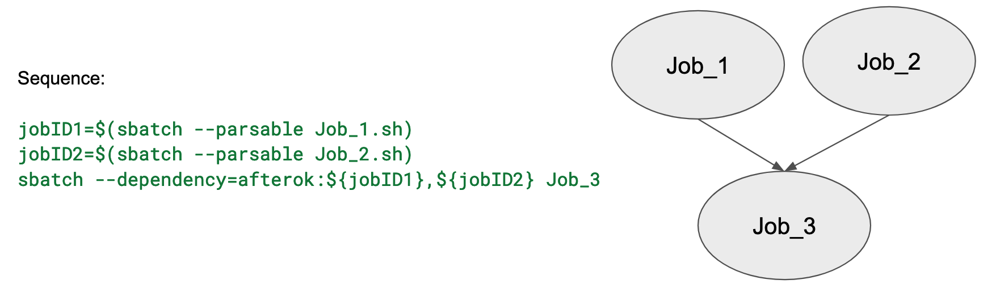
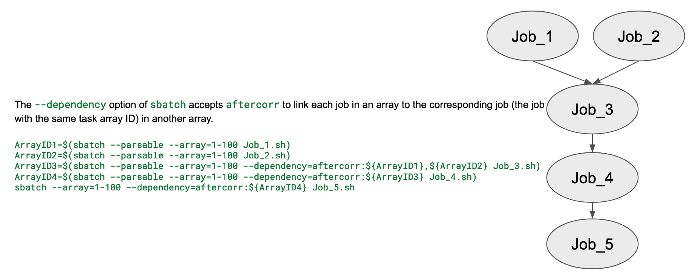
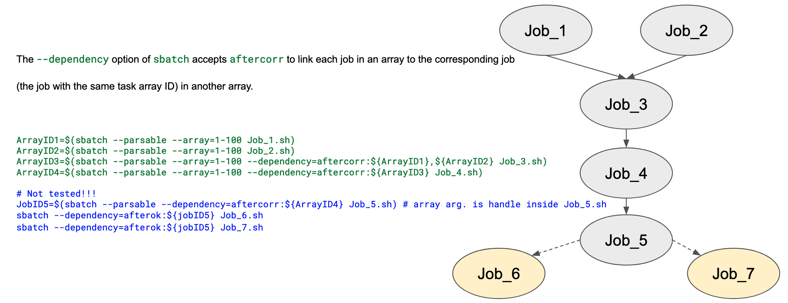

# Slurm_dependecies
## Building pipelines using slurm dependencies

Here you will find a brief explanation with examples to understand *slurm-dependency* and *slurm-array dependency* concepts. Follow the flow and feel free to test the code.
<br><br>

### Introduction to Job array and Job dependency 

A **Job-array** is the best and recommended way to submit many jobs (>100) using SLURM’s jobs array feature. The job arrays allow managing big number of jobs more effectively and faster. To specify job array use **--array**, follow for the number of jobs you will have in array:

Some examples are:

**--array=0-9**: there are 10 jobs in array. The first job has index 0, and the last job has index 9.

**--array=5-8**: there are 4 jobs in array. The first job has index 5, and the last job has index 8.

**--array=2,4,6**: there are 3 jobs in array with indices 2, 4 and 6.

<br>

A **Job-dependency** in the other hand is a particular *Job* that must be launched only after previous *jobs* were successfully completed. SLURM provides a way to implement such pipelines with its **--dependency** option.


You can submit a job that only runs after successful completion of the first job with specific labels, like **“afterok”** as the dependency type. 

```diff
+ $ jobID=$(sbatch --parsable job.cmd)
+ $ sbatch --dependency=afterok:${jobID} second_job.cmd
```

Note that, by adding the **“–parsable”** option to “sbatch command”, only the job ID would be returned and its value can be stored in a shell variable for later use.

<br> 

More popular dependency types used for **<type:job_id>** are: 


| Option                                | Description      |
|:--------------------------------------|:-----------------|
| **--dependency=afterok:<job_id>**     | Submitted job will be launched if and only if job with job_id identifier was successfully completed. If job_id is a job array, then all jobs in that job array must be successfully completed. | 
| **--dependency=afternotok:<job_id>**  | Submitted job will be launched if and only if job with job_id identifier failed. If job_id is a job array, then at least one job in that array failed. This option may be useful for cleanup step. | 
| **--dependency=afterany:<job_id>**    | Submitted job wil be launched after job with job_id identifier terminated i.e. completed successfully or failed. | 


<br>


Since version 16.05, Slurm has an option of **--dependency=aftercorr:job_id[:jobid...]**. A task of this job array can begin execution after the corresponding task ID if the specified job has completed successfully. This option is commonly used to run Job-array dependencies recursively.

There are other options.

<br> 

Now, with these SLURM's options we can build pipelines combining slurm array with slurm dependencies. 

<br> 

### Job-array: single dependency

In figure 1A and 1B, we have a sequence A --> B

 <p style="text-align:center"> Image 1. Job_1 is a dependency of Job_0. </p> <br><br>


The Job_0 is a job-array that triggers 5 processes to build 5 txt files.
The Job_1 is a job-array that triggers 5 processes to add lines to pre-existing files. So, *Job_1* must be launched only after previous *Job_0* were successfully completed, in other words, it is a dependency file of Job_0.

<br>

### Job-array dependency: independent or sequenced

To add a bit more of complexity, now let's add a third Job to add numeric lines to the pre-exisiting txt files after the *Job_0* and *Job_1* were successfully completed.

 <p style="text-align:center"> Image 2. Job_1 and Job2 are dependencies of Job_0. </p> <br><br>


### Does the order of the processes matter?

<br>

 <p style="text-align:center"> Image 3. In the top figure the processes are always executed in the same order. In the bottom figure there are two independent processes with two possible outputs. </p> <br><br>

<br>


### Job-array dependency nested

We use logic to build the Job-array dependencies recursively. Let's to build the next pipeline: **( A → B ) → C**

First, we link the first job dependency:

```diff
# Create 5 txt files and add lines to them"
+ ArrayAID=$(sbatch --parsable --array=1-5  Job_0.sh)
# echo "Job-Array. ID: ${ArrayAID}"
# echo ""
# This will runs after first dependency has been completed. Add lines to pre-existing file.
+ sbatch --array=1-5 --dependency=aftercorr:${ArrayAID} Job_1.sh
```
Not run this code! copy from scripts.

**--parsable** option capture the slurm ID (number) assigned to control each *Array Id*. Thus, with *ArrayAID* variable we can conditioned the next task. 

After successfully completed the corresponding array process using the *ArrayAID*, it starts the corresponding array process in Job_1

<br>

Second, we link the second dependency:

```diff
# Create 5 txt files and add lines to them"
+ ArrayAID=$(sbatch --parsable --array=1-5  Job_0.sh)
# echo "Job-Array. Dependency 1 ID: ${ArrayAID}"
# echo ""
# Add lines to pre-existing file
+ ArrayBID=$(sbatch --parsable --array=1-5 --dependency=aftercorr:${ArrayAID} Job_1.sh)
# echo "Job-Array. Dependency 2 ID: ${ArrayBID}"
# echo ""
# Add numbers to pre-existing file
# This will runs after first and second dependencies have been completed. 
+ sbatch --array=1-5 --dependency=aftercorr:${ArrayBID} Job_2.sh
```
Not run this code! copy from scripts.


Again we use **--parsable** option, but now beside to capture the *ArrayAID*, we also capture *ArrayBID* to condition the next process in Job_2. 

After successfully completed the corresponding array-id process *ArrayAID* and *ArrayBID*, it starts the next array-id process in Job_2.

<br>

More examples provided below highlight the relevance of Slurm job design to properly build the workflow.

<br><br>


### Examples with job-dependency 

 <p style="text-align:center"> Image 4. Job with one dependency.  </p> <br><br>

<br>

 <p style="text-align:center"> Image 5. Job with two dependencies.  </p> <br><br>

<br><br>

### Examples with Job-array dependencies recursively

A task of this job array can begin execution after the corresponding task ID in the specified job has completed successfully.

 <p style="text-align:center"> Image 6. Job-array dependencies nested.  </p> <br><br>

<br>

 <p style="text-align:center"> Image 7. Another Job-array dependencies nested.  </p> <br><br>

<br>


***

<br>


*Cynthia SC*

Nov 3rd, 2023

<br>

***

<br>

**Consulted resources:**


http://research.libd.org/slurmjobs/ 

https://hpc.hku.hk/guide/slurm-guide/slurm-job-dependencies/

https://groups.oist.jp/scs/advanced-slurm

https://www.icg.port.ac.uk/support-kb/ex-9-slurm-arrays-deps/ 

https://stackoverflow.com/questions/73389379/slurm-job-array-with-dependent-jobs

<br><br>

**Other resources:**


You can request a Data Science guidance sessions (DSgs) with us!
Here: https://lcolladotor.github.io/bioc_team_ds/data-science-guidance-sessions.html 

<br><br>


